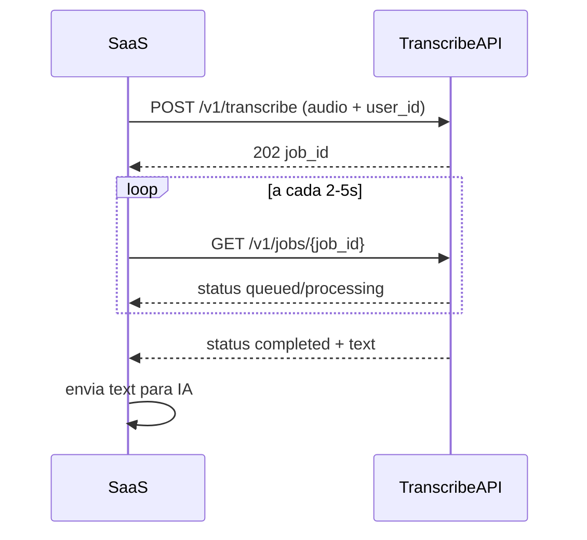

# Transcribe API

API assíncrona de transcrição de áudio para integração com seu SaaS (gravações de atendimento, áudios do WhatsApp, etc.).

## Stack

- **FastAPI** — HTTP API
- **faster-whisper** — transcrição local (CPU, sem custo por minuto)
- **ffmpeg** — conversão de formatos de áudio
- **SQLite** — fila local de jobs
- **Supabase** — métricas operacionais (texto opcional)

## Quick start (desenvolvimento local)

```bash
cd "Transcrição audio"
python -m venv .venv

# Windows
.venv\Scripts\activate

# Linux / macOS
source .venv/bin/activate

pip install -r requirements.txt
cp .env.example .env
# Edite .env e defina API_KEY

python -m app.main
```

A API sobe em `http://127.0.0.1:8000`. Documentação interativa: `http://127.0.0.1:8000/docs`

### Testar no navegador (dev)

```powershell
.\run_dev.ps1
```

Abra **http://127.0.0.1:8000/dev** — página para enviar áudio e ver a transcrição.

- API Key padrão local: `dev-local-key` (definida em `.env`)
- Use `WHISPER_MODEL=base` no `.env` para testes mais rápidos no PC
- Desative o playground em produção: `DEV_UI_ENABLED=false`

> **Requisito:** [ffmpeg](https://ffmpeg.org/) instalado e disponível no PATH.

## Variáveis de ambiente

Copie [`.env.example`](.env.example) para `.env`.

| Variável | Descrição | Padrão MVP |
|----------|-----------|------------|
| `API_KEY` | Chave secreta para o SaaS autenticar | obrigatório |
| `WHISPER_MODEL` | Modelo Whisper (`tiny`, `base`, `small`) | `small` |
| `SAVE_AUDIO` | Persistir arquivos de áudio | `false` |
| `SAVE_TRANSCRIPT` | Salvar texto no Supabase | `false` |
| `SAVE_METRICS` | Salvar métricas no Supabase | `true` |
| `SUPABASE_URL` | URL do projeto Supabase | — |
| `SUPABASE_SERVICE_KEY` | Service role key (só no servidor) | — |

## Endpoints

| Método | Rota | Auth |
|--------|------|------|
| `GET` | `/health` | Não |
| `POST` | `/v1/transcribe` | Sim |
| `GET` | `/v1/jobs/{job_id}` | Sim |
| `GET` | `/v1/metrics/summary` | Sim |

## Documentação

- **[Integração no SaaS](docs/SAAS-INTEGRATION.md)** — passo a passo para colar no projeto do SaaS e pedir à IA integrar
- **[Uso da API](docs/API.md)** — autenticação, exemplos, polling, erros
- **[Deploy na VPS](docs/DEPLOY-VPS.md)** — passo a passo Linux, DNS, HTTPS

## Supabase

Execute a migration em [`supabase/migrations/001_transcription_jobs.sql`](supabase/migrations/001_transcription_jobs.sql) no SQL Editor do painel Supabase.

## Deploy

Arquivos prontos em [`deploy/`](deploy/):

- `transcribe-api.service` — systemd
- `nginx-transcribe.conf` — reverse proxy (substitua `SEUDOMINIO.com`)

Siga o guia completo em [docs/DEPLOY-VPS.md](docs/DEPLOY-VPS.md).

## Fluxo com o SaaS



## Privacidade (LGPD)

No MVP recomendado:

- Áudio **nunca** é persistido (`SAVE_AUDIO=false`)
- Texto **não** vai para o Supabase (`SAVE_TRANSCRIPT=false`), mas é retornado na API para o seu SaaS processar
- Métricas operacionais **sim** (`SAVE_METRICS=true`): `user_id`, duração, tempo de processamento, modelo, status
