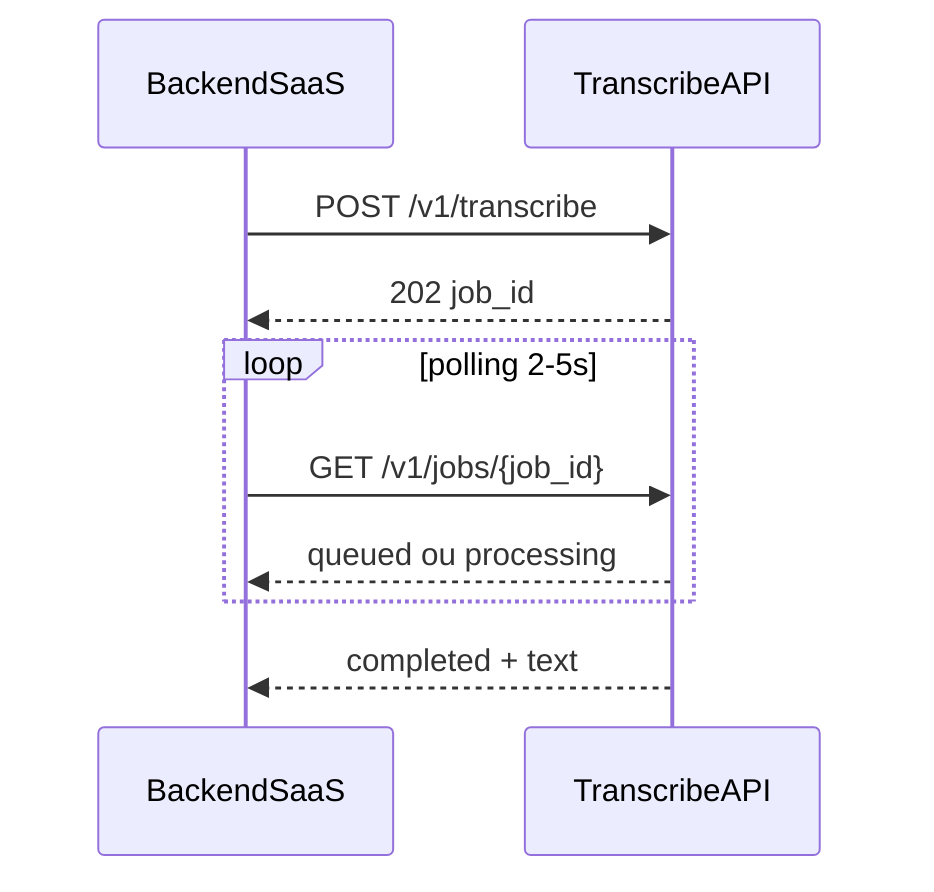

# Guia da API de Transcrição

Base URL em produção (exemplo):

```
https://transcribe.SEUDOMINIO.com
```

Em desenvolvimento local:

```
http://127.0.0.1:8000
```

---

## Autenticação

Todos os endpoints `/v1/*` exigem header:

```
Authorization: Bearer SUA_API_KEY
```

A `API_KEY` fica no `.env` da VPS e **somente no backend do seu SaaS**. Nunca exponha no frontend do navegador.

---

## Fluxo assíncrono (recomendado)

A transcrição é **assíncrona**: você envia o áudio, recebe um `job_id`, e consulta o status até ficar pronto.



### Por que assíncrono?

- Áudios longos (atendimentos de 20–30 min) podem levar vários minutos em 1 vCPU
- A fila processa **1 job por vez** na VPS atual
- Seu SaaS não fica com conexão HTTP aberta por minutos

---

## Endpoints

### `GET /health`

Verifica se a API está no ar. **Não precisa de autenticação.**

**Resposta 200:**

```json
{
  "status": "ok",
  "model": "small",
  "queue_pending": 0
}
```

---

### `POST /v1/transcribe`

Envia um áudio para transcrição.

**Content-Type:** `multipart/form-data`

| Campo | Tipo | Obrigatório | Descrição |
|-------|------|-------------|-----------|
| `file` | arquivo | Sim | Áudio (ogg, mp3, m4a, wav, webm, opus, aac, flac) |
| `user_id` | string | Sim | ID do usuário/tenant no seu SaaS |
| `source` | string | Não | `whatsapp`, `recording` ou `other` |

**Resposta 202:**

```json
{
  "job_id": "550e8400-e29b-41d4-a716-446655440000",
  "status": "queued",
  "poll_url": "/v1/jobs/550e8400-e29b-41d4-a716-446655440000"
}
```

**Limites:**

| Limite | Valor |
|--------|-------|
| Tamanho máximo | 50 MB |
| Duração máxima | 60 minutos |
| Rate limit | 10 jobs/minuto por `user_id` |

---

### `GET /v1/jobs/{job_id}`

Consulta o status e resultado de um job.

**Status possíveis:**

| Status | Significado |
|--------|-------------|
| `queued` | Na fila, aguardando processamento |
| `processing` | Sendo transcrito agora |
| `completed` | Pronto — campo `text` disponível |
| `failed` | Erro — ver `error_message` |

**Resposta `processing`:**

```json
{
  "job_id": "550e8400-e29b-41d4-a716-446655440000",
  "status": "processing",
  "user_id": "user_123",
  "source": "whatsapp",
  "text": null,
  "duration_seconds": 45.2,
  "processing_time_seconds": null,
  "model": "small",
  "error_message": null,
  "created_at": "2026-06-13T12:00:00+00:00"
}
```

**Resposta `completed`:**

```json
{
  "job_id": "550e8400-e29b-41d4-a716-446655440000",
  "status": "completed",
  "user_id": "user_123",
  "source": "recording",
  "text": "Olá, bom dia. Gostaria de agendar uma consulta...",
  "duration_seconds": 842.5,
  "processing_time_seconds": 312.1,
  "model": "small",
  "error_message": null,
  "created_at": "2026-06-13T12:00:00+00:00"
}
```

---

### `GET /v1/metrics/summary`

Resumo agregado de uso (dados do Supabase). Útil para saber quem está consumindo mais.

**Resposta 200:**

```json
{
  "totals": [
    {
      "user_id": "user_123",
      "job_count": 42,
      "total_duration_seconds": 3600.5,
      "total_processing_time_seconds": 1200.3
    }
  ],
  "total_jobs": 42,
  "total_duration_seconds": 3600.5,
  "total_processing_time_seconds": 1200.3
}
```

> Requer `SAVE_METRICS=true` e Supabase configurado.

---

## Exemplos

### curl — enviar áudio

```bash
curl -X POST "https://transcribe.SEUDOMINIO.com/v1/transcribe" \
  -H "Authorization: Bearer SUA_API_KEY" \
  -F "file=@/caminho/para/audio.ogg" \
  -F "user_id=cliente_42" \
  -F "source=whatsapp"
```

### curl — consultar job

```bash
curl "https://transcribe.SEUDOMINIO.com/v1/jobs/550e8400-e29b-41d4-a716-446655440000" \
  -H "Authorization: Bearer SUA_API_KEY"
```

### curl — health check

```bash
curl "https://transcribe.SEUDOMINIO.com/health"
```

---

### JavaScript (Node.js / backend do SaaS)

```javascript
const API_BASE = "https://transcribe.SEUDOMINIO.com";
const API_KEY = process.env.TRANSCRIBE_API_KEY;

async function transcribeAudio(fileBuffer, filename, userId, source = "other") {
  const form = new FormData();
  form.append("file", new Blob([fileBuffer]), filename);
  form.append("user_id", userId);
  form.append("source", source);

  const createRes = await fetch(`${API_BASE}/v1/transcribe`, {
    method: "POST",
    headers: { Authorization: `Bearer ${API_KEY}` },
    body: form,
  });

  if (!createRes.ok) {
    const err = await createRes.json();
    throw new Error(err.detail || "Failed to create transcription job");
  }

  const { job_id } = await createRes.json();

  // Polling até completed ou failed
  for (let attempt = 0; attempt < 360; attempt++) {
    await new Promise((r) => setTimeout(r, 3000));

    const statusRes = await fetch(`${API_BASE}/v1/jobs/${job_id}`, {
      headers: { Authorization: `Bearer ${API_KEY}` },
    });

    const job = await statusRes.json();

    if (job.status === "completed") {
      return job.text;
    }

    if (job.status === "failed") {
      throw new Error(job.error_message || "Transcription failed");
    }
  }

  throw new Error("Transcription timed out while polling");
}
```

---

### Python (backend do SaaS)

```python
import time

import httpx

API_BASE = "https://transcribe.SEUDOMINIO.com"
API_KEY = "sua-api-key"


def transcribe_audio(file_path: str, user_id: str, source: str = "other") -> str:
    headers = {"Authorization": f"Bearer {API_KEY}"}

    with httpx.Client(timeout=60.0) as client:
        with open(file_path, "rb") as audio_file:
            response = client.post(
                f"{API_BASE}/v1/transcribe",
                headers=headers,
                data={"user_id": user_id, "source": source},
                files={"file": (file_path, audio_file, "audio/ogg")},
            )
        response.raise_for_status()
        job_id = response.json()["job_id"]

        for _ in range(360):
            time.sleep(3)
            status_response = client.get(
                f"{API_BASE}/v1/jobs/{job_id}",
                headers=headers,
            )
            status_response.raise_for_status()
            job = status_response.json()

            if job["status"] == "completed":
                return job["text"]
            if job["status"] == "failed":
                raise RuntimeError(job.get("error_message", "Transcription failed"))

    raise TimeoutError("Transcription timed out while polling")
```

---

## Integração por caso de uso

### WhatsApp (áudio curto)

1. Seu backend recebe o áudio do provedor WPP (webhook)
2. Chama `POST /v1/transcribe` com `source=whatsapp`
3. Faz polling até `completed`
4. Envia `text` para o chatbot/IA
5. Responde ao usuário no WPP

**Dica:** áudios curtos costumam ficar prontos em segundos quando a fila está vazia.

### Gravação de atendimento (áudio longo)

1. Usuário grava no seu SaaS
2. Backend envia o arquivo com `source=recording`
3. Polling com intervalo de 5s (pode levar vários minutos)
4. Quando pronto, envia `text` para a IA de sumarização
5. Exibe o resumo na aba de atendimento

**Dica:** mostre ao usuário um status "Transcrevendo..." enquanto o polling roda.

---

## Códigos de erro

| HTTP | Causa comum |
|------|-------------|
| `400` | Arquivo vazio, formato inválido, áudio muito longo/grande |
| `401` | API key ausente ou incorreta |
| `404` | `job_id` não encontrado |
| `429` | Rate limit (10 jobs/min por `user_id`) |
| `500` | Erro interno (ver logs na VPS) |

**Exemplo de erro 400:**

```json
{
  "detail": "Audio exceeds maximum duration of 60 minutes"
}
```

---

## Privacidade

Com as flags padrão do MVP:

| Dado | Onde fica |
|------|-----------|
| Áudio | Temporário em disco, apagado após processar |
| Texto | Retornado na API; **não** salvo no Supabase |
| Métricas | Salvas no Supabase (`user_id`, duração, tempo, modelo, status) |

Para salvar texto no Supabase depois: `SAVE_TRANSCRIPT=true` no `.env`.

---

## Checklist de integração no SaaS

- [ ] Guardar `TRANSCRIBE_API_KEY` como variável de ambiente no backend
- [ ] Implementar `POST /v1/transcribe` ao receber áudio
- [ ] Implementar polling em `GET /v1/jobs/{id}`
- [ ] Tratar `failed` e timeout de polling
- [ ] Passar `user_id` real do tenant para métricas
- [ ] Usar `source` correto (`whatsapp` ou `recording`)
- [ ] Nunca expor a API key no frontend
